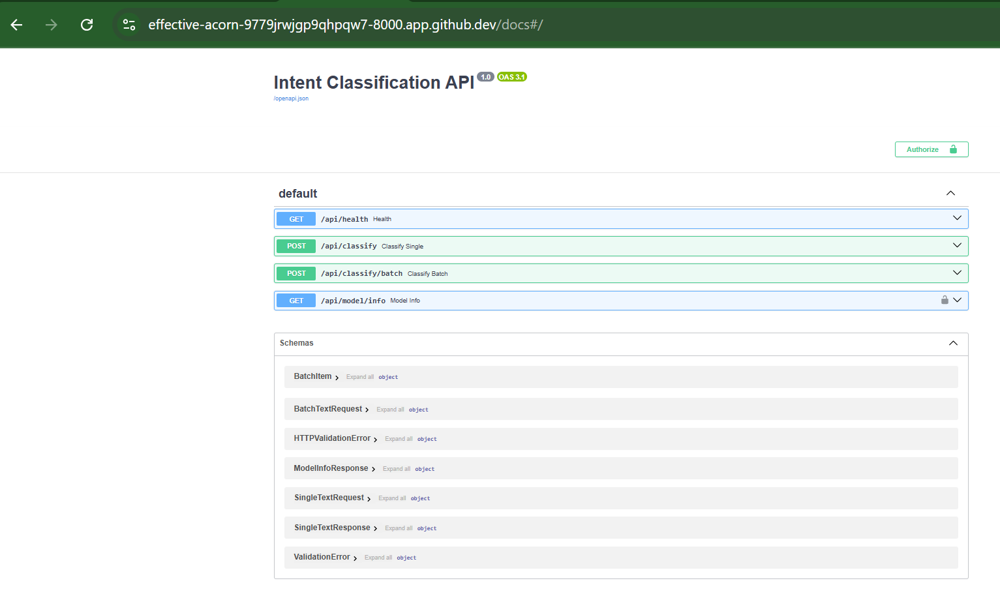
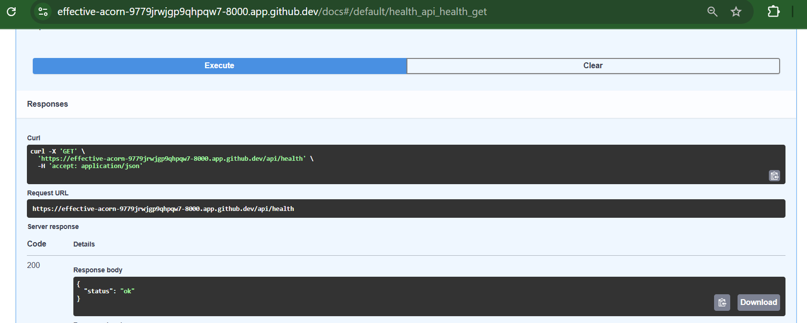
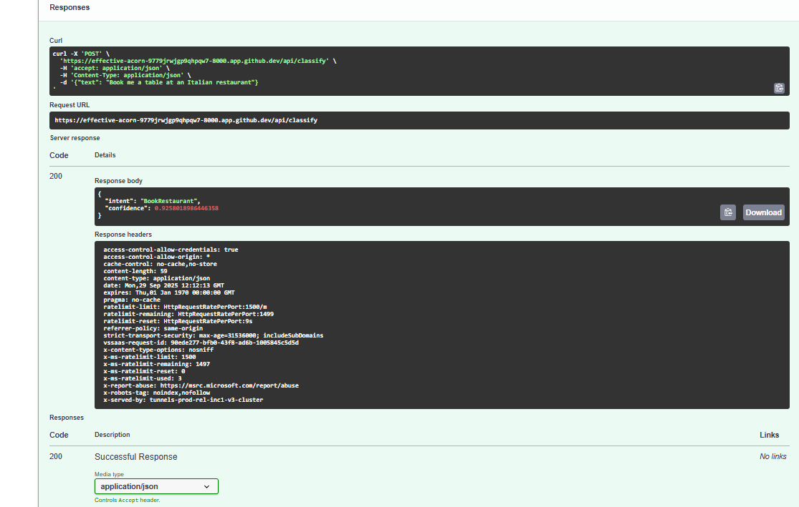
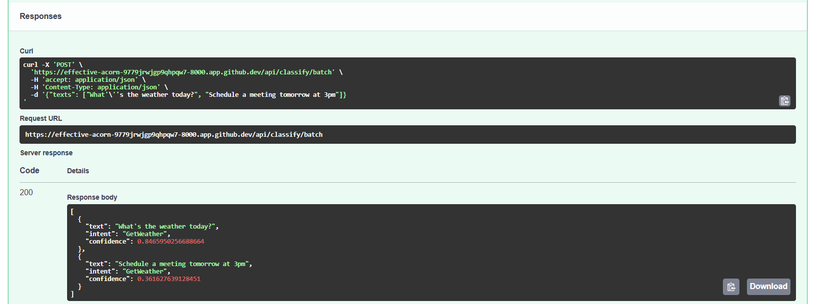
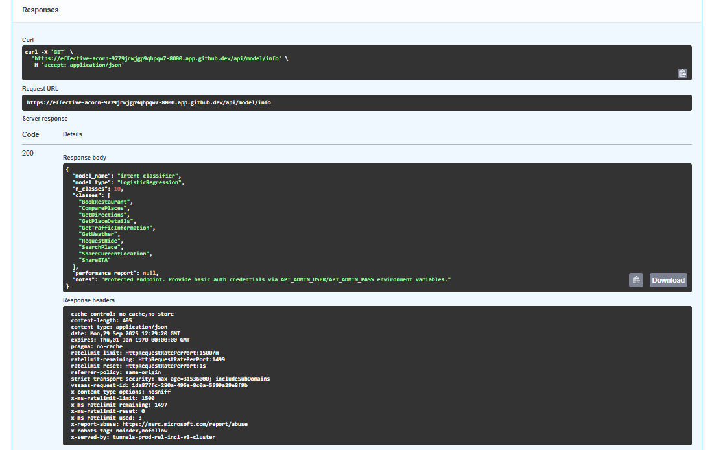

# Intent Classification with FastAPI

This project implements an **end-to-end intent classification system** — from dataset preprocessing and model development to evaluation and deployment as a FastAPI service.

It was developed as part of an **Assessment**, and covers the full ML pipeline:

* Dataset selection & preprocessing
* Feature engineering & model selection
* Model training, optimization, and evaluation
* Error analysis & insights
* Deployment via FastAPI with Docker support

---

## 📂 Dataset Selection

I used the **SNIPS dataset** (publicly available on HuggingFace/Kaggle). It provides multiple user intents in natural language queries, such as booking restaurants, getting weather info, etc.

From this dataset, we extracted **10 intent classes**, including:

* `BookRestaurant`
* `ComparePlaces`
* `GetDirections`
* `GetPlaceDetails`
* `GetTrafficInformation`
* `GetWeather`
* `RequestRide`
* `SearchPlace`
* `ShareCurrentLocation`
* `ShareETA`

Dataset split:

* **80% train**
* **10% validation**
* **10% test**

---

## ⚙️ Project Structure

```
ML/
  data/                     # Dataset + artifacts
    benchmark_data.json
    train.csv
    val.csv
    test.csv
    class_weights.json
    classification_report.txt
  preprocess.py             # Data cleaning + split
  train.py                  # Model training + selection
  evaluate.py               # Evaluation + error analysis
  model.pkl                 # Trained model

api/
  main.py                   # FastAPI app entrypoint
  endpoints.py              # API routes
  models.py                 # Request/response schemas
  auth.py                   # Basic Auth for protected endpoints
  tests/
    test_api.py             # Unit tests

requirements.txt
Dockerfile
README.md
```

---

## 🛠️ Setup Instructions

### 1. Clone the repository

```bash
git clone https://github.com/anjupy/intent-classification-fastapi.git
cd intent-classification-fastapi
```

### 2. Create a virtual environment

```bash
python -m venv .venv
source .venv/bin/activate    # Linux/Mac
.venv\Scripts\activate       # Windows
```

### 3. Install dependencies

```bash
pip install -r requirements.txt
```

---

## 📊 Step 1: Data Preprocessing

Run preprocessing to clean and split dataset:

```bash
python ML/preprocess.py --input-file ML/data/benchmark_data.json --output-dir ML/data
```

This will:

* Clean text (lowercase, remove punctuation, normalize spaces).
* Tokenize and prepare train/val/test splits.
* Handle class imbalance (weights saved to `class_weights.json`).

---

## 🤖 Step 2: Model Training & Selection

Train multiple models (Logistic Regression, Naive Bayes, SVM, Random Forest):

```bash
python ML/train.py
```

Outputs:

* Cross-validation results for each algorithm.
* Best model (Logistic Regression) saved to `ML/model.pkl`.

---

## 📈 Step 3: Evaluation

Evaluate trained model on the test set:

```bash
python ML/evaluate.py
```

Generates:

* Accuracy, Precision, Recall, F1-score (per class + macro/weighted).
* Confusion matrix and learning curves.
* Prediction confidence distribution.
* Misclassified examples (`misclassified.csv`).
* Outputs stored in `ML/eval_outputs/`.


---

## 🚀 Step 4: FastAPI Deployment

### Run API locally

```bash
uvicorn api.main:app --reload --host 0.0.0.0 --port 8000
```

### API Endpoints

* `GET /api/health` → Health check
* `POST /api/classify` → Classify single query
* `POST /api/classify/batch` → Classify multiple queries
* `GET /api/model/info` → Model metadata (requires Basic Auth)

### Example Requests

**Single query:**

```bash
curl -X POST "http://127.0.0.1:8000/api/classify" \
     -H "Content-Type: application/json" \
     -d '{"text": "Book me a table at an Italian restaurant"}'
```

Response:

```json
{"intent":"BookRestaurant","confidence":0.92}
```

**Batch queries:**

```bash
curl -X POST "http://127.0.0.1:8000/api/classify/batch" \
     -H "Content-Type: application/json" \
     -d '{"texts": ["What is the weather today?", "Schedule a meeting tomorrow at 3pm"]}'
```

---

## 🔒 Authentication

The `/api/model/info` endpoint is protected with Basic Auth.

Set credentials before running:

```bash
export API_ADMIN_USER=admin
export API_ADMIN_PASS=password
```

Then call with:

```bash
curl -u admin:password http://127.0.0.1:8000/api/model/info
```

---

## 🐳 Step 5: Docker Deployment

Build and run container:

```bash
docker build -t intent-classifier-api .
docker run -e API_ADMIN_USER=admin -e API_ADMIN_PASS=password -p 8000:8000 intent-classifier-api
```

---

## 🧪 Unit Tests

Run tests with:

```bash
pytest -q
```

Covers:

* `/api/health`
* `/api/classify`
* `/api/classify/batch`
* `/api/model/info` auth behavior

---

## 📸 Screenshots of Results

Include the following in your submission:

1. Swagger UI (`/docs`) showing endpoints.  
   

2. `/api/health` returning `{"status": "ok"}`.  
   

3. `/api/classify` result with intent + confidence.  
   

4. `/api/classify/batch` with multiple queries.  
   

5. `/api/model/info` showing model type and classes.  
   

6. **For Confusion matrix, Confidence_ Distribution, Learning Curve, classification performance charts etc refer to the directory, eval_outputs.**
7. **Status Codes**
* INFO:     182.184.143.105:0 - "GET / HTTP/1.1" 404 Not Found
* INFO:     182.184.143.105:0 - "GET /favicon.ico HTTP/1.1" 404 Not Found
* INFO:     182.184.143.105:0 - "GET /docs HTTP/1.1" 200 OK
* INFO:     182.184.143.105:0 - "GET /api/health HTTP/1.1" 200 OK
* INFO:     182.184.143.105:0 - "GET /api/classify HTTP/1.1" 405 Method Not Allowed
* INFO:     182.184.143.105:0 - "GET /api/model/info HTTP/1.1" 401 Unauthorized

---

## ✅ Conclusion

This project demonstrates a production-ready intent classification system, optimized for lightweight deployment using FastAPI and Docker.

The best-performing model **Logistic Regression** achieved strong performance with high precision, recall, and F1-score. A full evaluation pipeline is implemented, including confusion matrix visualization, learning curves, confidence distribution analysis, and error inspection via misclassified samples.
**RESULTS**
**Logistic Regression: CV F1 ~ 0.8360 (best)**

**Naive Bayes: CV F1 ~ 0.6529, Val Acc ~ 72.7%**

**SVM: CV F1 ~ 0.8279, Val Acc ~ 81.8%**

**Random Forest: CV F1 ~ 0.7421, Val Acc ~ 72.7%**

---
